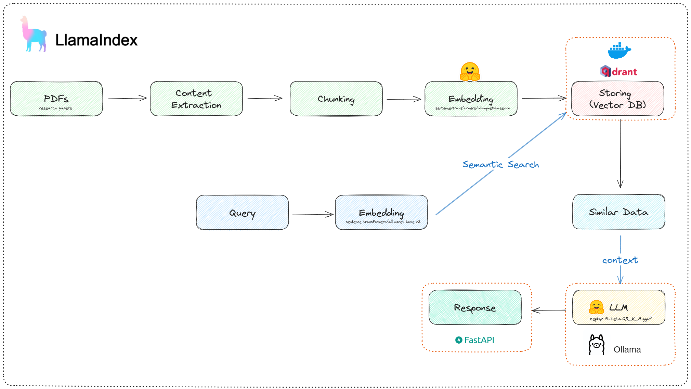
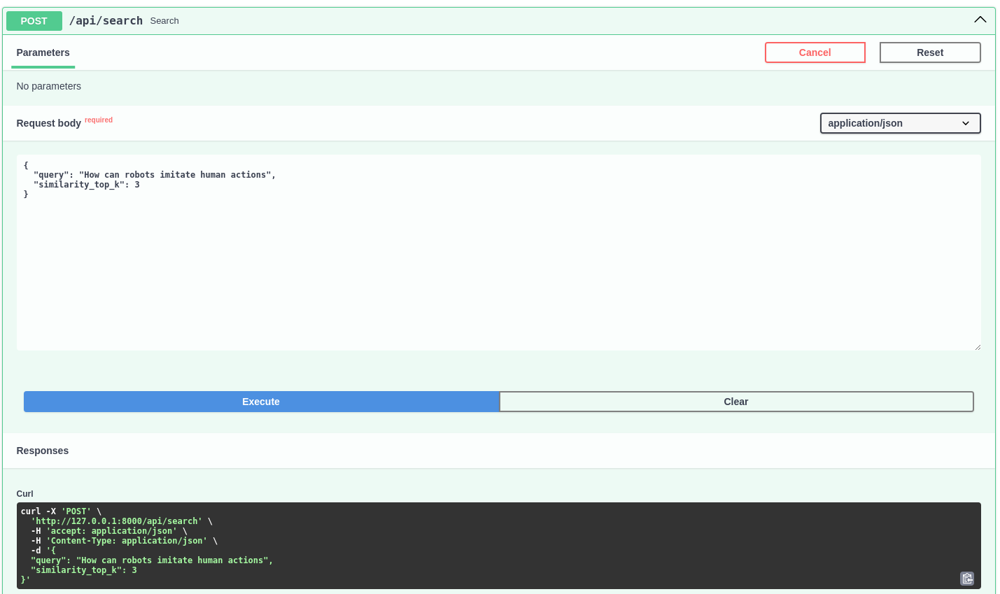
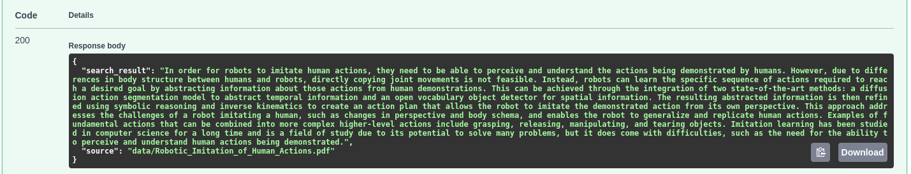

# RAG: Research-assistant


This project aims to help researchers find answers from a set of research papers with the help of a customized RAG pipeline and a powerfull LLM, all offline and free of cost.

For more details, please checkout the [blog post](https://otmaneboughaba.com/posts/local-rag-api) about this project.

## How it works



1. Download some research papers from Arxiv
2. Use Llamaindex to load, chunk, embed and store these documents to a Qdrant database
3. FastAPI endpoint that receives a query/question, searches through our documents and find the best matching chunks
4. Feed these relevant documents into an LLM as a context
5. Generate an easy to understand answer and return it as an API response alongside citing the sources

## Running the project

### Quick Start (Docker Compose)

This project now uses Docker and Docker Compose for easier setup and reproducibility.

#### 1. Clone the Repo

```bash
git clone https://github.com/Otman404/local-rag-llamaindex
cd local-rag-llamaindex
```

#### 2. Build the Docker images

```bash
docker compose build
```

This will:

* Build a rag-base-image containing shared dependencies (LlamaIndex, llama-index, etc.)

* Build the api service (FastAPI backend) using Dockerfile in api/

* Build the data_ingestion service used for downloading and indexing research papers using Dockerfile in data/

#### 3. Run All Services

```bash
docker compose up ollama qdrant api
```

This starts:

* **API** server (FastAPI on port `8000`)
* **Qdrant** vector DB (port `6333`)
* **Ollama** LLM server (port `11434`)

#### 4. Download & Ingest Papers

To ingest new research papers into Qdrant:

```bash
docker compose run data_ingestion --query "LLM" --max 5 --ingest
```

`--query`: search keyword for downloading research papers from Arxiv.

`--max`: Limits the results.

`--ingest`: Ingests the downloaded papers into the Qdrant database.

This uses `arxiv` to fetch papers, chunk them with LlamaIndex, and store them into Qdrant.

> ✅ You should now be able to query the API at `http://localhost:8000`

#### Stopping & Clean Up

To stop all running containers and networks started by Docker Compose:

```bash
docker compose down
```

### Running the project manually with uv

#### Starting a Qdrant docker instance

```bash
docker run -p 6333:6333 -v ~/qdrant_storage:/qdrant/storage:z qdrant/qdrant
```

#### Setting up the environment

Inside the project folder run

```bash
# create virtual env with uv
uv venv
# activate the virtual env
source .venv/bin/activate
# install project dependencies
uv pip install ".[dev]"
```

#### Downloading & Indexing data

```bash
uv run data/data.py --query "LLM" --max 5 --ingest
```

#### Starting Ollama LLM server

Follow [this article](https://otmaneboughaba.com/posts/local-llm-ollama-huggingface/) for more infos on how to run models from hugging face locally with Ollama.

Create model from Modelfile

```bash
ollama create research_assistant -f ollama/Modelfile 
```

Start the model server

```bash
ollama run research_assistant
```

By default, Ollama runs on ```http://localhost:11434```

#### Starting the api server

```bash
uv run fastapi api/main.py dev
```

## Example

### Request



### Response


